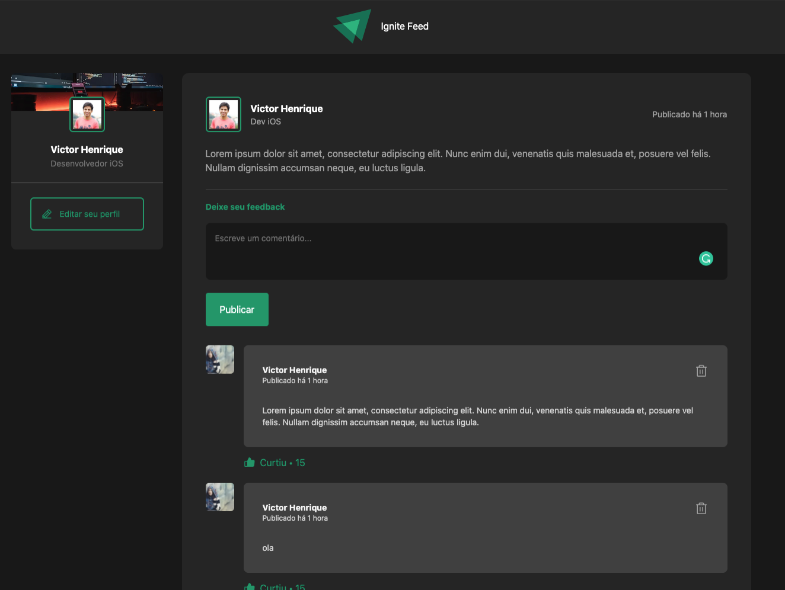

# ignite 2022 - modulo 01

Recriei o design sugerido no curso ignite da [rockerseat](rocketseat.com.br). Eu assiste o curso para ver se havia novo conceito, depois tentei recriar o design por contra própria utilizando ferramentas de meu interesse.

Nesse projeto recriamos uma página de um blog com componentes de Posts e comentários

## Reference

- [Rocketseat](https://rocketseat.com.br)

## Demo

Insira um gif ou um link de alguma demonstração

## Objective

### Tecnologias

- React
- Tailwind
- Vite

## Feature

- Criar novos comentários para um determinados Post
- Remover comentários para um Post

## Improvements

- Adicionar testes unitários
- Adicionar mock de servidor

## License

[MIT](https://choosealicense.com/licenses/mit/)
